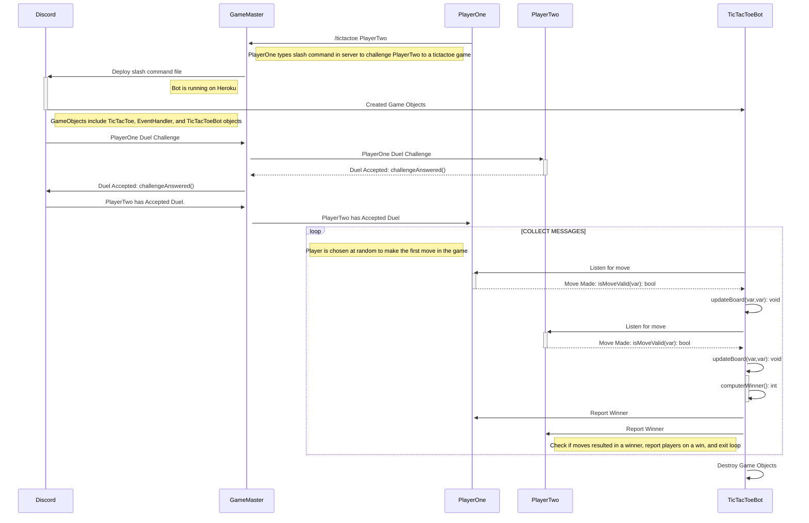

# Sequence Diagram For Player Duel Accepted

This sequence diagram illustrates a player challenging another player to a TicTacToe duel. PlayerOne uses slash command /tictactoe PlayerTwo to challenge to a game of TicTacToe. GameMaster recieves the slash command and sends request to Discord to instantiate the necessary objects to run a game of TicTacToe. TicTacToeBot then sends the duel request to PlayerTwo. PlayerTwo responds accepts the duel. This results in TicTacToeBot collecting messages from PlayerOne and PlayerTwo. The first move of the game is chosen at random. Each move is verified to make sure it is the correct player making the move. The board is updated after everymove. After each player makes a move TicTacToeBot checks for a winner. If no winner is found the process is repeated until a player has won. Once a player has won each player is notified. TicTacToeBot and associated objects are then destroyed. If a new game wants to be played it will be initiated with GameMaster.

            
