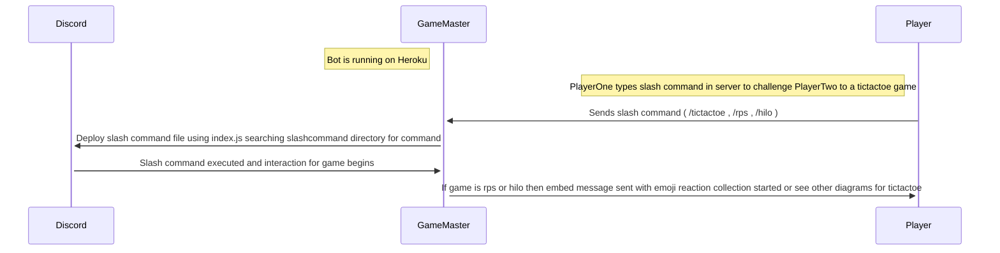

# Sequence Diagram For GameMaster Slash Commands

This sequence diagram illustrates a player using a slash command. The slash command is looked for in the slash command directory and executed. The game then begins. If embed 
message games are played than emoji reaction collection begins other wise see other diagrams in project documents for tictactoe duel accept and reject sequence diagrams.
