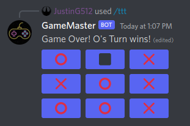
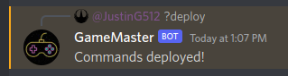
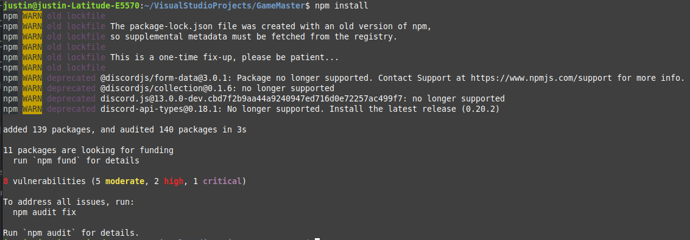

# GameMaster (Games with Friends!)
Put here a short paragraph describing your project. 
Adding an screenshot or a mockup of your application in action would be nice.  

## Remove this just adding to pull



# How to run

Start the bot with `node index.js` OR `nodemon index.js` and it should be online!

You now need to deploy the slash commands. Use the `?deploy` command to deploy all of the commands to Discord.



Now you can do `/ping` and should get a response!

To start a tic tac toe game, type `/ttt` and click the buttons! 

# How to contribute
Follow this project board to know the latest status of the project: [http://...]([http://...])  

### How to build

- Use this github repository: ... 

If you want to run this yourself, you will need:

-   [Discord Bot Application](https://discord.com/developers)
-   [NodeJS](https://nodejs.org) OR
-   [Nodemon](https://www.npmjs.com/package/nodemon) 

Invite the bot to your server. To get the permissions to create the slash commands, you will need to grant it special permissions. Put your bot's client ID here and grant it permission:

`https://discord.com/api/oauth2/authorize?client_id=<---CLIENT ID HERE--->&scope=applications.commands`

Once you have sucessfully invited the bot to your server, you need to install the npm dependencies.

Run `npm install` to install all of the dependencies



Now you need to put your bot token in a `.env` file.
You will also need to put the guild ID of the server you want the bot to be in.

```
TOKEN=<TOKEN>
GUILD=<GUILD ID>
```
