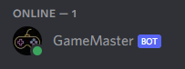
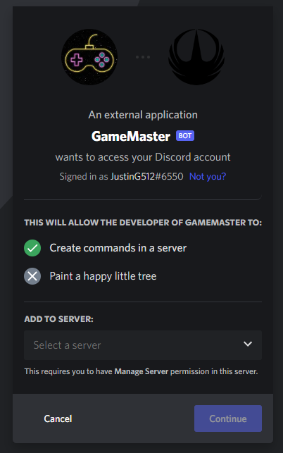
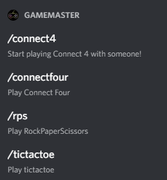

# GameMaster (Games with Friends!)
GameMaster is a discord bot that allows users to play smaller board games such as Tic Tac Toe, Rock-Paper-Scissors and Connect Four. The goal of GameMaster is to provide a hub where users can play multiple games with friends using Discord. Users can customize settings to their liking for an optimal experience.  



# How to add the bot to your server

- Click the invite Link: https://discord.com/api/oauth2/authorize?client_id=1032689897573732483&permissions=8&scope=bot%20applications.commands
- Use the dropdown to select the server you would like to add GameMaster in.
- Click 'Continue'



# How to use GameMaster in your server

- GameMaster is controlled using slash commands.  Begin by typing '/' in a shared channel for more options.  
- Current supported slash commands are /connect4, /connectfour, /rps, and /tictactoe



# How to contribute

- If you would like to use our open source project in your own project, you will need to create a .env file with the Token.  Please contact us for more information! 

### How to build and Run

- Clone this github repository. If you are unfamiliar with how to clone a github repository please watch this short video: https://www.youtube.com/watch?v=q9wc7hUrW8U

#### You will need to sign up for the following:
-   [Discord Bot Application](https://discord.com/developers)
-   Once signed in navigate to the applications tab and click create a new application. Then go to the bot tab and click add bot. Copy the token and paste the token in the .env file that you will create below in a later step. DO NOT EXPOSE YOUR TOKEN TO ANYBODY INCLUDING ON A PUBLIC GITHUB REPOSITORY!!! On the same website go to OAuth2 tab and click URL generator sub tab. Decide what you want the bot to do. Beware if the bot is given admin permissions. Take the link generated and paste in your own web browser then select what server you want to add the bot too. Add it to the server and click continue. Authorize the bot.

#### You will need to download the following:
-   [NodeJS](https://nodejs.org) OR
-   [Nodemon](https://www.npmjs.com/package/nodemon) 

Invite the bot to your server. To get the permissions to create the slash commands, you will need to grant it special permissions. Put your bot's client ID here and grant it permission:

`https://discord.com/api/oauth2/authorize?client_id=<---CLIENT ID HERE--->&scope=applications.commands`
Once you have sucessfully invited the bot to your server, you need to install the npm dependencies.
Run `npm install` to install all of the dependencies


Now you need to put your bot token in a `.env` file. In the project directory create a file called `.env`. Then you can add your token and optionally if you choose you can add the  guild ID of the server you want the bot to be in to the .env file also as shown below.

```
TOKEN=<TOKEN>
GUILD=<GUILD ID>
```

#### Start bot server on local machine:
-Start the bot with `node index.js` OR `nodemon index.js` depending on what you downloaded prior and the bot will be online!

#### Starting bot server on heroku:
-Please see (heroku_instructions_for_deploy.docx)
