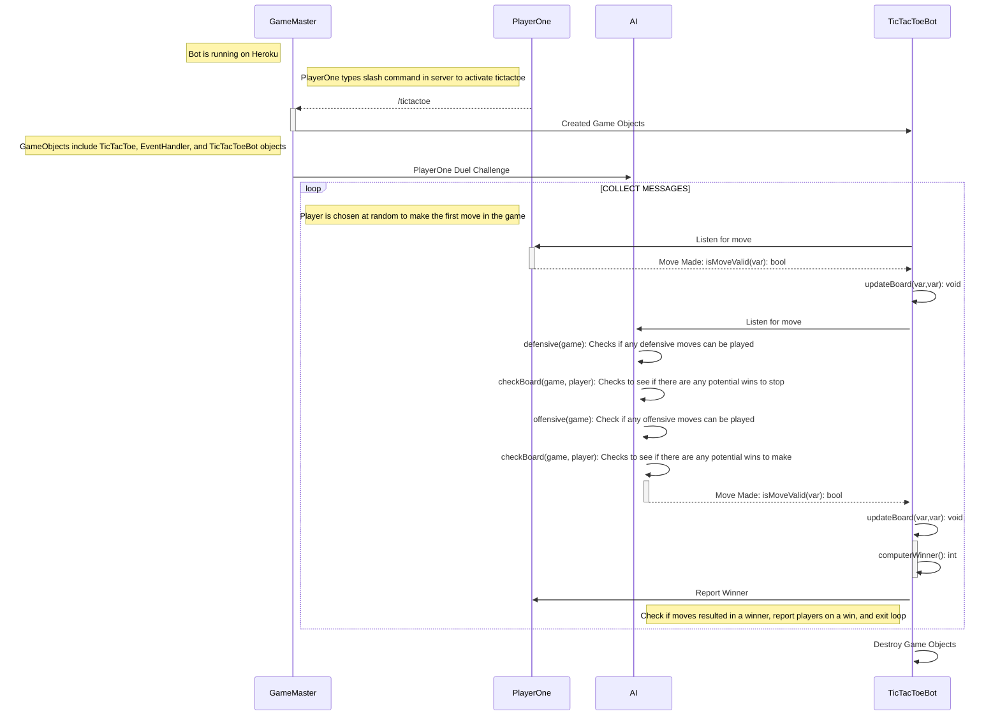

# Sequence Diagram For Player Duel Rejected

This sequence diagram illustrates a player challenging the AI to a TicTacToe duel. PlayerOne uses slash command /tictactoe to create a game of TicTacToe. GameMaster recieves the slash command and instantiates the necessary objects to run a game of TicTacToe. TicTacToeBot then sends the duel request to the AI, which automatically accepts and starts the game. A starting player is chosen at random, and then that player gets to go first. If it is the player, they click the location they want to choose, and then TicTacToeBot checks to see if the move is valid. Once the move has been determined valid or invalid, TicTacToeBot will either have PlayerOne try again, or notify PlayerTwo (the AI) it is their turn, respectively. The AI will then see if there are any defensive moves to be made, followed by any offensive moves. If no moves are found, it will randomly select and available spot to fill.
The turns go back and forth until a winner is determined.
