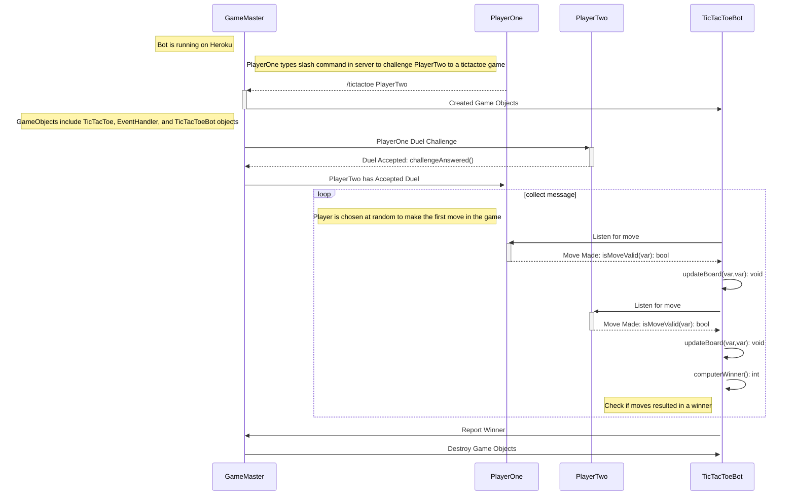

# Sequence Diagram For Player Duel Accepted

```mermaid
sequenceDiagram
  
    participant GameMaster as GameMaster
    participant PlayerOne as PlayerOne
    participant PlayerTwo as PlayerTwo
    participant TicTacToeBot as TicTacToeBot
    
    Note left of GameMaster: Bot is running on Heroku
    Note left of PlayerOne: PlayerOne types slash command in server to challenge PlayerTwo to a tictactoe game
    PlayerOne-->>+GameMaster: /tictactoe PlayerTwo
    GameMaster->>-TicTacToeBot: Created Game Objects
    Note left of GameMaster: GameObjects include TicTacToe, EventHandler, and TicTacToeBot objects
    GameMaster->>+PlayerTwo: PlayerOne Duel Challenge
    PlayerTwo-->>-GameMaster: Duel Accepted: challengeAnswered()
    GameMaster->>+PlayerOne: PlayerTwo has Accepted Duel
    loop collect message
    Note left of PlayerOne: Player is chosen at random to make the first move in the game
    TicTacToeBot->>+PlayerOne: Listen for move
    PlayerOne-->>-TicTacToeBot: Move Made: isMoveValid(var): bool
    TicTacToeBot->>+TicTacToeBot: updateBoard(var,var): void
    TicTacToeBot->>+PlayerTwo: Listen for move
    PlayerTwo-->>-TicTacToeBot: Move Made: isMoveValid(var): bool
    TicTacToeBot->>+TicTacToeBot: updateBoard(var,var): void
    TicTacToeBot->>+TicTacToeBot: computerWinner(): int
    Note left of TicTacToeBot: Check if moves resulted in a winner
    end
    TicTacToeBot->>GameMaster: Report Winner
    GameMaster->>TicTacToeBot: Destroy Game Objects
```
            
