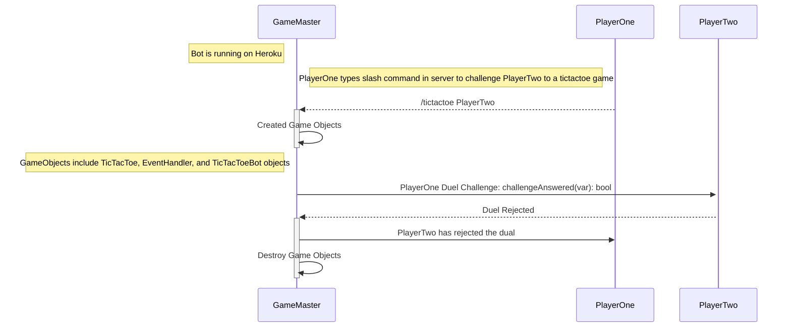

# Sequence Diagram For Player Duel Rejected

```mermaid
sequenceDiagram
  
    participant GameMaster as GameMaster
    participant PlayerOne as PlayerOne
    participant PlayerTwo as PlayerTwo
    Note left of GameMaster: Bot is running on Heroku
    Note left of PlayerOne: PlayerOne types slash command in server to challenge PlayerTwo to a tictactoe game
    PlayerOne-->>+GameMaster: /tictactoe PlayerTwo
    GameMaster->>-GameMaster: Created Game Objects
    Note left of GameMaster: GameObjects include TicTacToe, EventHandler, and TicTacToeBot objects
    GameMaster->>+PlayerTwo: PlayerOne Duel Challenge: challengeAnswered(var): bool
    PlayerTwo-->>+GameMaster: Duel Rejected
    GameMaster->>PlayerOne: PlayerTwo has rejected the dual
    GameMaster->>-GameMaster: Destroy Game Objects
    
```
