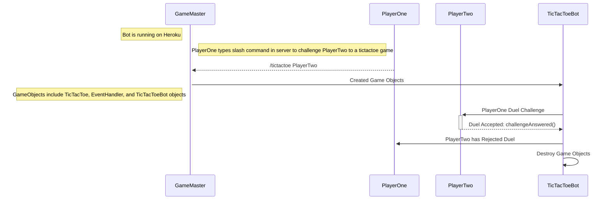

# Sequence Diagram For Player Duel Rejected

This sequence diagram illustrates a player challenging another player to a TicTacToe duel. PlayerOne uses slash command /tictactoe PlayerTwo to challenge to a game of TicTacToe. GameMaster recieves the slash command and instantiates the necessary objects to run a game of TicTacToe. TicTacToeBot then sends the duel request to PlayerTwo. PlayerTwo responds rejected the duel. This results in TicTacToeBot terminating along with all the associated objects.
